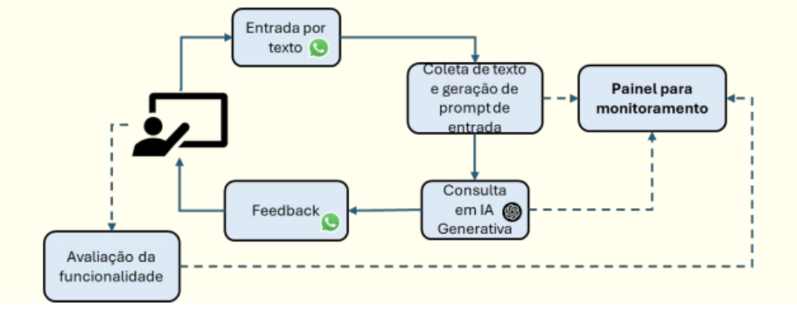
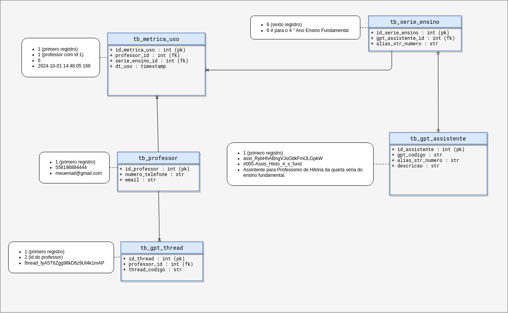

 

## Problemática

Segundo a pesquisa do professor Cleon, 69,5% das escolas não possuem laboratório de informática, na região norte apresentam os piores índices de conexão de internet móvel, 13,1% das escolas sem internet e 2,2% das escolas sem energia elétrica. Baseado nisso, é sabido que os professores de ensino fundamental se utilizam de seus smartphones para realizarem seus planejamentos de aula, produzirem materiais e exercícios, com uma internet de pouca qualidade.

 

## Análise de soluções

Sendo assim, a proposta é a criação de uma assistente virtual, integrada ao WhatsApp, em que há a coleta do número de telefone do professor, é realizado algumas perguntas-chave e o material de aula é disponibilizado conforme as escolhas do mesmo, e tudo isso exigindo uma conexão razoável de internet, para ser trabalhado a equidade do ensino básico brasileiro.

 

## Anterioridades

Já existem ferramentas com uso bem semelhante a essa ideia, mas o diferencial é que essa assistente não exige altos recursos de internet, além de ser específico para o ensino básico.

 

## Objetivo

Desenvolver uma aplicação com painel de acompanhamento que permita aos docentes interagir, a partir do WhatsApp, com uma IA Generativa, para suporte educacional. 

### Desafio 1: IA Generativa e Educação: proposta de uma ferramenta para suporte a docentes. 

 

## Equipe:

<table border="1px" style="width: 100%">
   <thead>
      <tr>
         <th style="width: 30%; text-align: center; background-color: #d6d3d1;">Nome</th>
         <th style="width: 20%; text-align: center; background-color: #d6d3d1;">Celular</th>
         <th style="width: 20%; text-align: center; background-color: #d6d3d1;">E-mail</th>
         <th style="width: 30%; text-align: center; background-color: #d6d3d1;">Função</th>
      </tr>
   </thead>
   <tbody>
      <tr>
            <td>Robson Passos de Souza</td>
            <td>(81) 988212347</td>
            <td>rps3@cesar.school</td>
            <td></td>
      </tr>
      <tr>
            <td>Rafael Freitas Lima</td>
            <td>(81) 988341541</td>
            <td>rfl2@cesar.school</td>
            <td></td>
      </tr>
      <tr>
            <td>Jonathan Henrique de Araujo Silva</td>
            <td>(81) 982467019</td>
            <td>jhas2@cesar.school</td>
            <td></td>
      </tr>
      <tr>
            <td>Juciarias Medeiros Nascimento</td>
            <td>(85) 981586400</td>
            <td>jmn2@cesar.school</td>
            <td></td>
      </tr>
      <tr>
            <td>Matheus Monteiro Lins</td>
            <td>(81) 994994094</td>
            <td>mml2@cesar.school</td>
            <td></td>
      </tr>

   </tbody>
</table>

## Repositório de Documentação do Projeto

<a href="https://drive.google.com/drive/u/2/folders/1mHKebFOU_om07Hdl-L5hNnVV2izaS84O">Google Driver</a>

 

# Tecnologias Utilizadas
   - Frontend:
      - node : 22.5
      - Next.js : 14.2.4
      - Tailwind.css : 3.4.3
      - Nextui-org : 2.0.37
      - typescript : 5.0.4

   - Backend:
      - Flask==3.0.3
      - gunicorn==22.0.0
      - requests==2.32.3
      - pytz==2024.1
      - SQLAlchemy==2.0.31
      - python-dotenv==1.0.1
      - openai==1.37.1
      - pandas==2.2.2
      - psycopg2-binary==2.9.9
      - Markdown==3.6

   - Banco de Dados:
      - PostgreSQL : 16.3-alpine (Imagem docker)

   - Estrutura:
      - Docker

## Estrutura da Base de Dados

